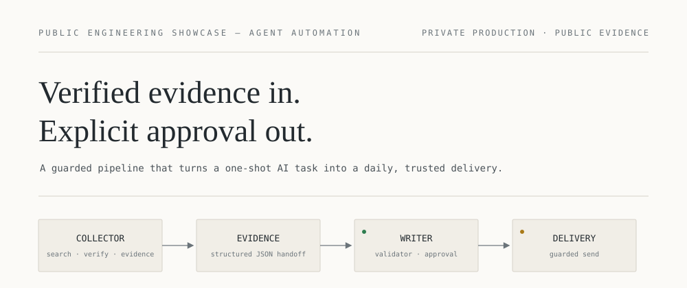
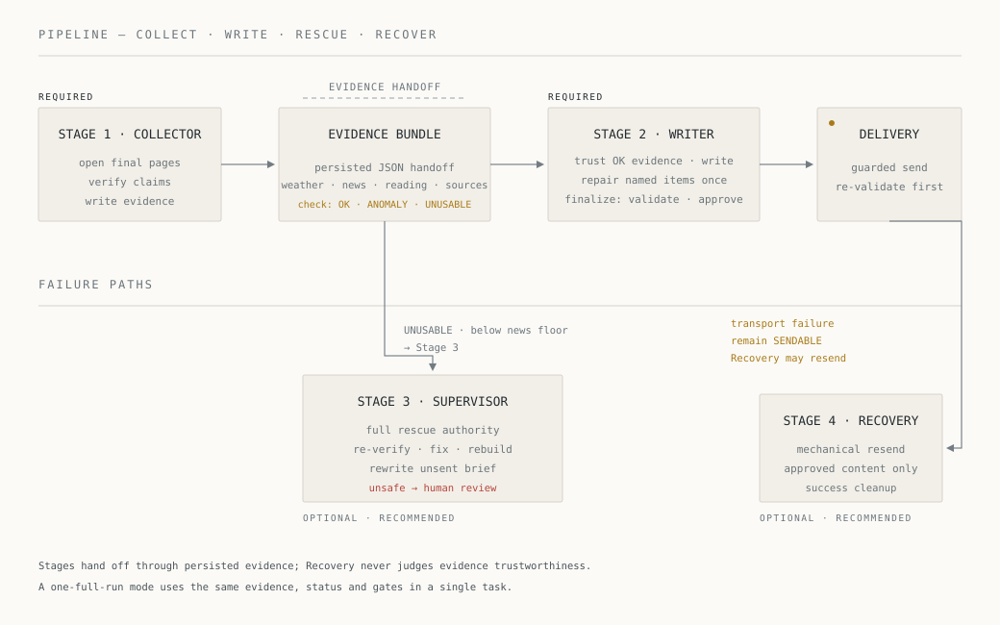
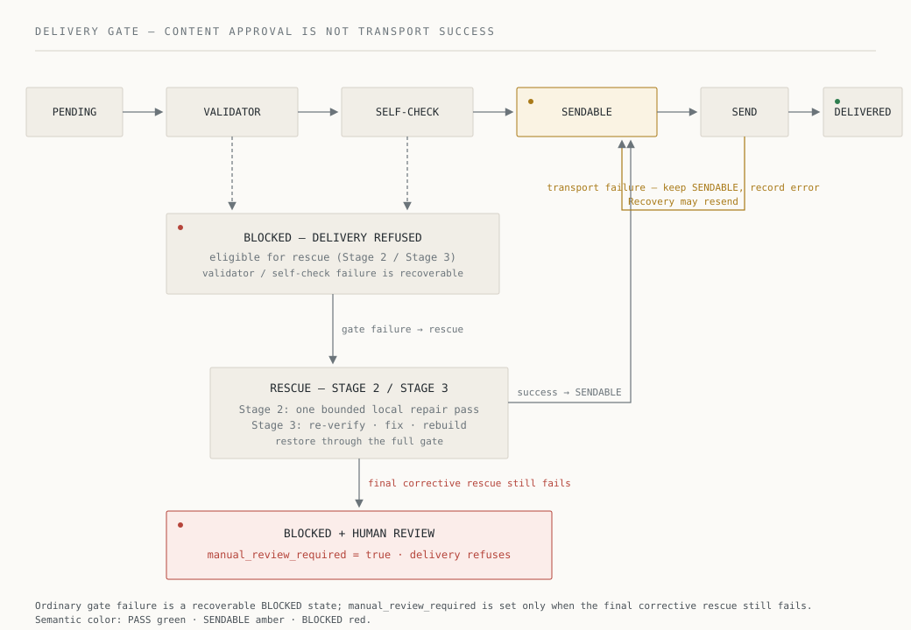

# Daily Brief Pipeline

**Public engineering showcase** for a private agent-automation pipeline. Its core rule is:

> **Verified evidence in. Explicit approval out.** An AI task may write only after verified evidence, and may deliver only after an explicit content-approval gate.

Since v1, this rule has a second half:

> **Gates protect the product; they do not replace it.** The goal is a brief worth reading every morning. Passing every check is not enough.

## What this repository is

This is a **showcase repository**, not an open-source distribution:

- The production project is a private system and remains private. It is not linked here.
- What is published is a curated set of real production evidence: architecture, design decisions, validation records, and a small number of reviewed source excerpts.
- The excerpts are published for portfolio and technical-review purposes only. **No open-source license is granted by this repository.**
- Cloning this repository does not produce a runnable system. No installer, release, or public edition is provided.

This is the second edition of the showcase. v1 (2026-08-10) described the reliability core. This edition, cut from production `1b5c8a8` (2026-10-07), adds two later upgrades. The pipeline became a portable Agent skill, and a quality regression was diagnosed and corrected.

## The problem

A morning-brief automation receives a one-shot AI task, every day and unattended: collect weather and news, verify sources, write a short Chinese Markdown brief, and deliver it by email.

The production design was shaped around two recurring failure modes:

1. **Long-context degradation.** Search and page-fetch results accumulate in one long session. By the time the agent writes, the context is large, noisy, and error-prone.
2. **Unsafe auto-delivery.** An agent that both writes and sends can ship unverified, placeholder-filled, or internally noisy content. It can also resend after a transport failure without a clear record of what was approved.

The pipeline answers both with the same mechanism: **separate collection from writing, and separate content approval from transport success.**

A third failure mode appeared later and is described in [Quality over gates](#quality-over-gates). **The engineering machinery itself can crowd out the product.**

## The pipeline

In the staged reference deployment, work is split into independent stages. Stages exchange **structured evidence files**, not long conversation context:

1. **Collector** *(required)*: opens final source pages, verifies claims, chooses what this reader should know before the day starts, and writes evidence JSON (weather, news, deep reading, sources). Each selected news item can carry a short editorial reason (`why_it_matters`) to the Writer.
2. **Writer/Sender** *(required)*: starts from a deterministic stage context computed by a script. That context includes an evidence check that returns `OK`, `ANOMALY`, `UNUSABLE`, or `MISSING`.
   - When the evidence is `OK`, the Writer trusts it as verified and writes.
   - When the check names item-level problems, the Writer runs one bounded repair pass on those items only.
   - A finalize script then runs the post-write check, the validator, and a brief-vs-evidence comparison. It persists the full approval state and hands off to the single delivery entry.
3. **Supervisor** *(recommended, optional)*: a conditional strong-model rescue stage. It first judges whether the day already succeeded. Only unfinished, failed, unusable, or below-floor runs enter rescue.
4. **Recovery** *(recommended, optional)*: a mechanical stage. It re-validates, sends only when approval already exists, and cleans up same-day artifacts after a successful send.

Evidence files are the boundary. The Collector never writes the final brief. The Writer's normal path starts from persisted evidence and does not run a second review of what the Collector verified. The only exception is a single item whose own fields contradict each other. No stage sends without the explicit approval state.

A second official contract, **one full run**, lets a capable agent collect and write in one task with the same evidence, status, and gates. It is documented in production but is not claimed here as production-validated. The staged mode remains the daily reference deployment.

## The safety model

- **Deterministic validator as hard gate.** A dependency-free PowerShell validator checks date, structure, named source links, placeholders, and internal process noise. The model cannot override it.
- **Content approval is not transport success.** The status model separates `delivery_allowed` (all content gates passed) from `email_sent` (the transport actually succeeded). A failed send never resets content approval, so a later stage can safely resend. Only a content-gate failure returns the run to BLOCKED.
- **Single guarded delivery entry.** All content stages deliver through one script. It re-runs the validator, checks the approval whitelist, and refuses when a human-review flag is set, even if other gate fields were wrongly set to SENDABLE.
- **Approval names the brief.** A status patch cannot enter SENDABLE unless `brief_path` names the existing, non-empty brief that will be sent.
- **Monotonic delivery record.** Once a status file records `email_sent=true`, a normal status patch cannot reset it to false.

## Failure and recovery

Repair follows a bounded gradient instead of unlimited agent improvisation:

1. **Stage 2: bounded local repair.** The deterministic evidence check names an item-level problem, such as a missing field, an unverified item, a site-root or search-page URL, or a duplicate URL. The Writer fixes or drops only those items, in one pass.
2. **Stage 3: full rescue authority.** The Supervisor steps in when evidence is unusable, missing, or below the news floor. It may re-verify, fix, delete, replace, or fully rebuild evidence and the unsent brief. It then runs the full gate again, with at most one corrective pass.
3. **BLOCKED + human review.** If the second full gate still fails, delivery is refused and the run is handed to a human. The delivery script blocks even if other fields were mislabeled as ready.

**Honest degradation.** The news count is a single config-driven contract:

- at or above the target: a normal brief;
- between the floor and the target: a legitimate shorter brief that is still sent, with no padding and no lowered verification;
- below the floor: not sendable, and escalated to rescue.

The gradient was first driven by a real failure mode: evidence that *exists* but is *untrusted*, for example news items pointing at an outlet homepage instead of a specific article. A later incident drove the opposite correction (see below).

## Quality over gates

In October 2026 the engineering gates and existing checks were passing, yet the daily brief had become **shorter, thinner, and slower to produce**. The diagnosis was a prompt and pipeline regression, not a model limit.

- **Engineering knowledge had crowded the runtime context.** Each stage read full schemas, status and gate semantics, the full config, and delivery rules on every run. Per the production change record, the fixed instructions had grown to about 2.4× the September production version.
- **Rules had been split into separate documents, but every consumer still read all of them.** The research policy and the Collector prompt carried two normal-path algorithms that contradicted each other.
- **A second LLM review overrode verified work.** On 2026-10-06, the Writer's pre-writing "health check" flagged a legitimate news domain as untrusted and dropped already-verified items.
- **"Passed the gates" had quietly replaced "a brief worth reading"** as the working objective.

The correction re-ordered the priorities explicitly:

> **Product / Editorial Quality > Research Integrity > Engineering Reliability.** Engineering mechanisms protect a high-quality result; they never replace it.

What changed:

| Normal-path fixed instructions (UTF-8 bytes) | Before the quality upgrade | After (`1b5c8a8`) |
| --- | ---: | ---: |
| Collector | 57 245 | **22 329** (−61 %) |
| Writer | 56 855 | **14 819** (−74 %) |

- **Byte measurement.** Byte counts are measured from the production repository at the pre-upgrade baseline and at `1b5c8a8`. Including the per-run JSON the stage reads, the production change record reports about 60 KB → 29 KB for the Collector and 60 KB → 17 KB for the Writer. In the same record, the share of Writer context about *how to write well* rose from about 8 % to about 44 %.
- **Deterministic facts moved into a script.** Date, weekday, paths, the config subset each stage needs, the time budget, the deduplication window, and the evidence check now come from a stage-context script. Agents no longer read the full config, the status schema, or the gate and delivery rules in the normal path.
- **Exception guidance loads just in time.** Evidence repair is read only on `ANOMALY`. The failure policy is read only on the failure path.
- **The Writer no longer re-reviews verified evidence.** The LLM health check was replaced by a structural check that never judges domain trust. State writing and sending moved into a finalize script, so the Writer no longer hand-writes approval patches.
- **The mission comes first.** Both prompts now open with who the brief is for and what makes it good; interfaces come last. News items are written as concise but substantive short paragraphs. Weather is written as impact on the day. The closing note is low-pressure and specific.
- **A regression guard keeps it that way.** A test asserts each stage's read chain and fails if fixed instructions exceed a per-stage budget (see [excerpt 05](code/05-context-budget-guard.ps1)).
- **The changes rest on external research.** They draw on six domains: Agent context engineering, journalism, weather risk communication, information design, personalization, and behavioral science. The research is compressed into a few production signals; see [docs/editorial-quality.md](docs/editorial-quality.md).

**Outcome.** After a qualitative review of the first real run following the upgrade (2026-10-07), the owner found editorial quality clearly restored and adopted that brief as a **new editorial reference**. This is the owner's assessment. It is not a factual gold standard, and it is not an A/B-tested or statistically validated result.

## From pipeline to portable skill

Between the two editions, the pipeline also became a portable, vendor-neutral Agent skill:

- **Separated layers.** Skill source, user data, and machine-local runtime paths live in different places. Machine paths never enter config or Profiles.
- **One config authority.** A single canonical config feeds every stage. Location Profiles are complete snapshots of it. Migration is explicit, previewed before applying, and fails closed on conflicts.
- **Local Settings.** A localhost-only Settings window edits preferences and switches Profiles. Every save is validated before writing, backed up, read back, validated again, and rolled back on any failure (see [excerpt 06](code/06-settings-save-transaction.ps1)). Saving is locked while a daily run is in progress.
- **Environment Doctor.** Each check reports *ok*, *attention*, *cannot confirm*, or *error*. The overall result summarizes only the required checks, and "cannot confirm" is never reported as healthy.
- **Desired state vs actual state.** Config schedules are desired state. Whether a scheduled job actually exists and runs must be checked on the external platform; neither the repository nor the Doctor can prove it.
- **Agent handoff.** Settings can produce a deployment request for the user's own Agent. The repository never creates or enables scheduled jobs by itself.
- **Recaps and knowledge.** Optional weekly, monthly, and archive recaps run automatically or as reminders. Their knowledge index is append-only JSONL behind a schema gate.

Windows with PowerShell 7 is the verified reference implementation. Other platforms need adaptation and are not claimed as verified.

## Real-code evidence

Seven curated excerpts, re-cut from production `1b5c8a8`, each with truthful provenance and a `verbatim` / `adapted (privacy and scope redactions only)` label:

| File | Theme | Label |
| --- | --- | --- |
| [code/01-validator-core-rules.ps1](code/01-validator-core-rules.ps1) | Deterministic validator: structure, named source links, placeholders, process-noise rejection | verbatim |
| [code/02-send-if-ready-gate.ps1](code/02-send-if-ready-gate.ps1) | Single guarded delivery entry: re-validation, approval whitelist, manual-review refusal, transport-failure handling | verbatim |
| [code/03-status-patch-protection.ps1](code/03-status-patch-protection.ps1) | Status patching: monotonic `email_sent`, `brief_path` guard for SENDABLE, atomic persistence | verbatim |
| [code/04-stage2-3-contract.ps1](code/04-stage2-3-contract.ps1) | Regression tests: `brief_path` guard, manual-review defense gate, successful rescue to SENDABLE | adapted — privacy and scope redactions only; control flow unchanged |
| [code/05-context-budget-guard.ps1](code/05-context-budget-guard.ps1) | Normal-path read-chain assertions and per-stage instruction byte budgets | verbatim |
| [code/06-settings-save-transaction.ps1](code/06-settings-save-transaction.ps1) | Settings save: validate → backup → write → read back → validate → roll back | verbatim |
| [code/07-evidence-check-news-floor.ps1](code/07-evidence-check-news-floor.ps1) | Deterministic evidence check: news floor, structural URL check, required fields | verbatim |

See [code/README.md](code/README.md) for production source references, exact line ranges, and the redaction list. The v1 excerpts (baseline `15b539a`) remain in Git history; they were re-cut to represent the current implementation, not because they became untrue.

## Validation

Validation evidence is recorded with explicit layers, and nothing is presented as something it is not:

- **Executable tests.** A local PowerShell suite plus JavaScript tests: 30 test files at the baseline, of which 27 are PowerShell test entry points. All 27 passed in the pre-merge Windows acceptance run. The suite covers gates and status, stage context and context budgets, config and migration, Settings, Doctor and runtime paths, knowledge and recaps, and prompt and documentation contracts.
- **End-to-end smoke.** A fake-mail run on Windows went from valid evidence through finalize and the delivery entry to `email_sent=true`. It used a temporary data root, touched no real data, and sent no real mail.
- **Manual review.** Editorial quality is judged by the owner reading real briefs. A scored rubric exists as a draft and is not yet used as a gate.
- **Design truth vs runtime truth.** This showcase describes the repository's design and contracts. It does not claim live runtime statistics, token or cost measurements, run durations, or delivery success rates.

The production repository does not configure CI; the tests are local and re-runnable. See [docs/validation.md](docs/validation.md).

## Design decisions

Why the pipeline looks the way it does is documented in [docs/design-decisions.md](docs/design-decisions.md). It covers the evidence handoff, the hard validator gate, the explicit approval state, the repair gradient, the design/runtime boundary, the product-layer decisions, and the quality-first corrections. The external knowledge behind the editorial standard is summarized in [docs/editorial-quality.md](docs/editorial-quality.md).

## Scope and privacy

- No real local paths, usernames, accounts, emails, logs, configuration values, Profile names or locations, status or evidence files, real briefs, private repository URLs, or third-party article content are published.
- Chinese comments and Chinese strings inside the excerpts are facts of the production product, not translation debt.
- This repository deliberately stays small. It is a portfolio companion, not a second software project.

## License

This repository is published as a technical showcase. No open-source license is currently provided.
